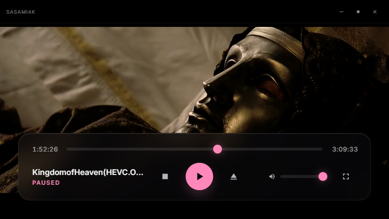

# Sasami4K




Sasami4K is a **WebView2 performance test repository** built with **F#**. It compares the same web-media desktop shell across **WPF**, **InfiniFrame**, and **Photino** to evaluate startup behavior, rendering feel, native-window overhead, and WebView2 hosting performance.

The app itself is a minimalist, modern desktop container for web-based playback interfaces. Each project keeps the experience similar while changing the host framework, making it easier to compare how WebView2 behaves in each environment.

## Project Versions

### 1. Sasami4K (WPF)
The original Windows-focused player, modernized for the latest .NET runtime.
- **Framework**: .NET 10.0-windows / WPF
- **Rendering Engine**: Microsoft Edge WebView2 (Chromium)
- **Features**: Native Mica/Acrylic support, high-DPI awareness, and deep Windows integration.
- **Project**: `Sasami4k.WindowApi/Sasami4k.WindowApi.fsproj`

### 2. Sasami4K InfiniFrame (Latest / High-Performance)
The latest version using the InfiniLore InfiniFrame framework for maximum performance and stability.
- **Framework**: .NET 10.0 / InfiniLore.InfiniFrame 0.12.0
- **Status**: **Recommended** (Optimized for .NET 10.0).
- **Features**: Low-overhead native windowing, advanced JS interop, and optimized resource loading.
- **Project**: `Sasami4k.InfiniFrame/Sasami4k.InfiniFrame.fsproj`

### 3. Sasami4K Photino (Legacy Cross-Platform)
A lightweight, cross-platform shell based on the original Photino project.
- **Framework**: .NET 10.0 / Photino.NET 2.6.0
- **Status**: Stable legacy version.
- **Project**: `Sasami4k.Photino/Sasami4k.Photino.fsproj`

## Technology Stack

- **Language**: F# 9.0+
- **Framework**: .NET 10.0
- **Rendering Engine**: Chromium (via WebView2)
- **Aesthetics**: Glassmorphism, Modern Dark Mode, Dynamic Favicons.

## Getting Started

### Prerequisites
- [.NET 10.0 SDK](https://dotnet.microsoft.com/download)
- [WebView2 Runtime](https://developer.microsoft.com/en-us/microsoft-edge/webview2/) (Included in Windows 10/11)

### Build and Run
To build all projects:
```powershell
dotnet build Sasami4k.slnx
```

To run a specific version:
```powershell
# WPF Version
dotnet run --project Sasami4k.WindowApi/Sasami4k.WindowApi.fsproj

# InfiniFrame Version (Recommended)
dotnet run --project Sasami4k.InfiniFrame/Sasami4k.InfiniFrame.fsproj

# Photino Version
dotnet run --project Sasami4k.Photino/Sasami4k.Photino.fsproj
```

---
*Sasami4K: The modern way to play web media on your desktop.*

**Specially Advanced Synchronized Accessible Media**
